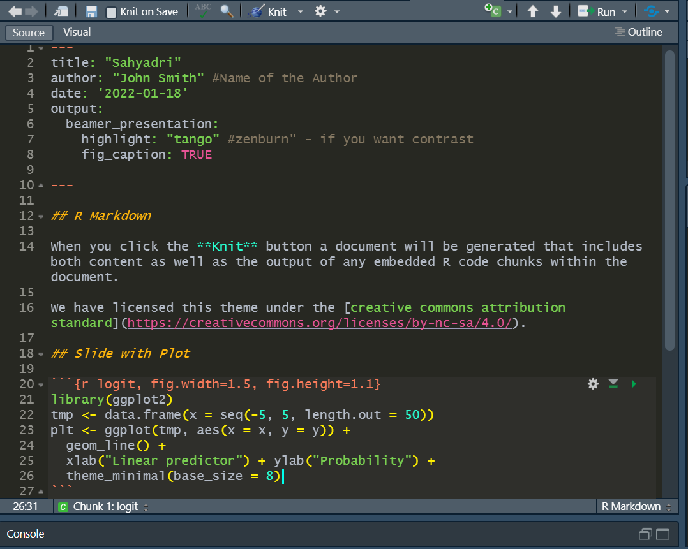

# Sahyadri

Dark RStudio theme inspired by the beautiful [Western Ghats](https://en.wikipedia.org/wiki/Western_Ghats) of India

This dark theme combines distinct hues of the tropical rainforests and highlands of South-Western India. The theme is designed for rmarkdown documents and presentations with focus on clearly distinguishing markdown, r code (numbers, strings, signs), text and comments. 

The theme will work for RStudio version 1.2 + 

## Installation

  1. Make sure that you have the latest version of RStudio [at least v1.2,](https://blog.rstudio.com/2019/04/30/rstudio-1-2-release/)
  
  2. Run this code in R `rstudioapi::addTheme("https://raw.githubusercontent.com/kvenkita/sahyadri/master/sahyadri.rstheme", TRUE, TRUE, FALSE)`

## Uninstallation / Change Theme

### Change Theme

To change your current theme, You can select your desired Theme by going to `Tools > Global Options > Appearance > Editor theme`

### Uninstallation

To uninstall **sahyadri** (removing it from the list of available Themes), Execute the following code:

`rstudioapi::removeTheme("sahyadri")`
